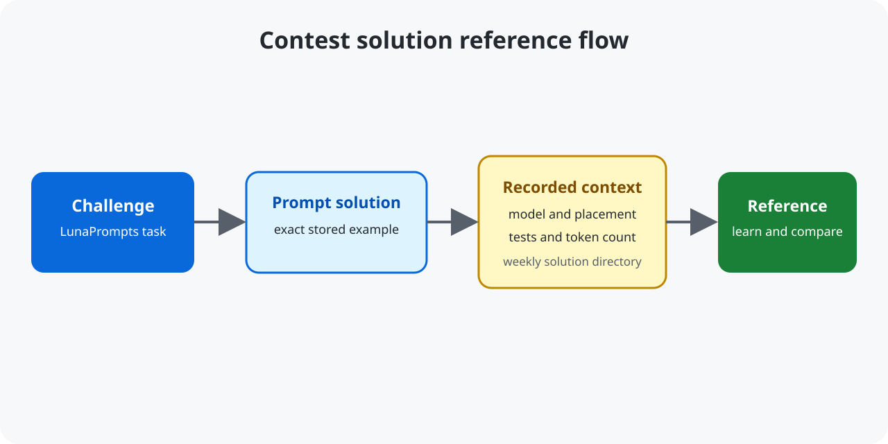

# LunaPrompts Contest Solutions — Prompt Engineering References

[](https://github.com/mikaeltorni/luna_prompts_contest_solutions/commits/master)
[](https://github.com/mikaeltorni/luna_prompts_contest_solutions/graphs/commit-activity)
[](https://github.com/mikaeltorni/luna_prompts_contest_solutions/issues)

luna_prompts_contest_solutions is a prompt reference that documents LunaPrompts contest solutions for people learning prompt engineering.



It records the exact prompts, models used (mostly **GPT-4.1**, plus **Kimi K2**),
test pass rates, and token counts for each challenge. The collection is useful
for studying token-efficient prompts for data extraction, classification, SQL
generation, and content moderation.

> Use these as an aid if you get stuck on a challenge — for learning, not to
> copy/cheat (the same contest prompts shouldn't repeat anymore). Thanks!

## Contents

- [LunaPrompts Contest Solutions Features](#lunaprompts-contest-solutions-features)
- [LunaPrompts Contest Solutions Results Summary](#lunaprompts-contest-solutions-results-summary)
- [Week 45 — winning prompt solutions](#week-45--winning-prompt-solutions)
- [Week 44 — winning prompt solutions](#week-44--winning-prompt-solutions)
- [Week 43 — winning prompt solutions](#week-43--winning-prompt-solutions)
- [Week 42 — third-place prompt solutions](#week-42--third-place-prompt-solutions)
- [Week 41 — winning prompt solutions](#week-41--winning-prompt-solutions)
- [Installation](#installation)
- [Usage Examples](#usage-examples)
- [Troubleshooting and FAQ](#troubleshooting-and-faq)

## Quickstart

Clone the reference collection and list a recent solution directory:

```bash
git clone https://github.com/mikaeltorni/luna_prompts_contest_solutions.git
cd luna_prompts_contest_solutions
find 2025_week45 -maxdepth 1 -type f | sort
```

The repository is documentation and prompt examples; no package installation
is required.

## LunaPrompts Contest Solutions Features

- Exact contest prompts linked to their LunaPrompts challenge pages.
- Recorded model, test-pass, placement, and token-count context where available.
- Examples covering extraction, moderation, SQL, classification, and workflow prompts.

The related [Prompt Challenge Generator](https://github.com/mikaeltorni/prompt_challenge_generator)
creates new promptfoo evaluation challenges from a theme.

## LunaPrompts Contest Solutions Results Summary

🥇4 (Week 41, 43, 44, 45)  
🥈0  
🥉1 (Week 42)  
+4th place: 0  

## Week 45 — winning prompt solutions
🥇1st place  
15/15 tests passed, 420 total tokens


### Week 45 solutions

[11 - Extracting Action Items from Meeting Notes](https://lunaprompts.com/challenges/11)  
31 tokens, [solution (GPT 4.1)](https://github.com/mikaeltorni/luna_prompts_contest_solutions/blob/master/2025_week45/11_Extracting_Action_Items_from_Meeting_Notes-GPT-4.1)

[12 - Orchestrator Prompt: AI Planner Prompt for Customer Ticket Workflow Generation](https://lunaprompts.com/challenges/12)  
389 tokens, [solution (GPT 4.1)](https://github.com/mikaeltorni/luna_prompts_contest_solutions/blob/master/2025_week45/12_Orchestrator_Prompt_AI_Planner_Prompt_for_Customer_Ticket_Workflow_Generation-GPT-4.1)


## Week 44 — winning prompt solutions
🥇1st place  
55/55 tests passed, 414 total tokens


### Week 44 solutions

[10 - Extracting Key Information from Resumes](https://lunaprompts.com/challenges/10)  
20 tokens, [solution (GPT 4.1)](https://github.com/mikaeltorni/luna_prompts_contest_solutions/blob/master/2025_week44/10_Extracting_Key_Information_from_Resumes-GPT-4.1)

[14 - Airport Code Analyst for Agent Mira](https://lunaprompts.com/challenges/14)  
394 tokens, [solution (GPT 4.1)](https://github.com/mikaeltorni/luna_prompts_contest_solutions/blob/master/2025_week44/14_Airport_Code_Analyst_for_Agent_Mira-GPT-4.1)

## Week 43 — winning prompt solutions
🥇1st place  
32/32 tests passed, 75 total tokens  


### Week 43 solutions

[8 - Master Moderator: The Gate at Zero Hour](https://lunaprompts.com/challenges/8)  
64 tokens, [solution (GPT 4.1)](https://github.com/mikaeltorni/luna_prompts_contest_solutions/blob/master/2025_week43/8_Master_Moderator_The_Gate_at_Zero_Hour-GPT-4.1)

[9 - [Hyperparameter Tuning] Detecting Hate Speech in Social Media Posts](https://lunaprompts.com/challenges/9)  
11 tokens, [solution (GPT 4.1)](https://github.com/mikaeltorni/luna_prompts_contest_solutions/blob/master/2025_week43/9_Hyperparameter_Tuning-Detecting_Hate_Speech_in_Social_Media_Posts-GPT-4.1)

## Week 42 — third-place prompt solutions
🥉 3rd place  
48/50 tests passed, 504 total tokens  


### Week 42 solutions

[7 - Generate SQL Queries for Sports Tournament Analysis](https://lunaprompts.com/challenges/7)  
361 tokens, [solution (GPT 4.1)](https://github.com/mikaeltorni/luna_prompts_contest_solutions/blob/master/2025_week42/7_Generate_SQL_Queries_for_Sports_Tournament_Analysis-GPT-4.1)

[6 - Tweet Tone Detector](https://lunaprompts.com/challenges/6)  
143 tokens, [solution (GPT 4.1)](https://github.com/mikaeltorni/luna_prompts_contest_solutions/blob/master/2025_week42/6_Tweet_Tone_Detector-gpt-4.1)  

## Week 41 — winning prompt solutions
🥇1st place  
50/50 tests passed, 209 total tokens  


### Week 41 solutions

[5 - [Zero Shot Prompting] Generate SQL Queries to retrieve User data based on input](https://lunaprompts.com/challenges/5)  
66 tokens, [solution (Kimi K2)](https://github.com/mikaeltorni/luna_prompts_contest_solutions/blob/master/2025_week41/5_Zero_Shot_Prompting-Generate_SQL_Queries_to_retrieve_User_data_based_on_input-kimi-k2)

[6 - Tweet Tone Detector](https://lunaprompts.com/challenges/6)  
143 tokens, [solution (GPT 4.1)](https://github.com/mikaeltorni/luna_prompts_contest_solutions/blob/master/2025_week41/6_Tweet_Tone_Detector-gpt-4.1)

## Installation

No installation is required. Clone the repository when you want a local copy
of the prompt examples and contest evidence.

## Usage Examples

Open a challenge link to understand the task, then open its solution link to
compare the prompt, model, token count, and reported test result. Treat the
prompts as learning references rather than submissions to repeat unchanged.

## Configuration

The collection has no runtime configuration. Model names, test counts, and
token counts are documentation attached to individual contest entries.

## Troubleshooting and FAQ

### What are LunaPrompts contest solutions?

They are prompt engineering examples from the weekly LunaPrompts contests,
organized with links to the original challenge pages and solution files. The
repository is a reference collection, not the LunaPrompts service itself.

### Which models appear in the collection?

The documented entries primarily use GPT-4.1 and also include Kimi K2. Each
solution identifies its model when that information is available.

### Can I use these prompts in a new contest?

Use them to learn prompt structure and token budgeting, but do not submit an
unchanged contest prompt. The README explicitly presents the collection as a
learning aid and notes that the original challenges should not be repeated.

### How should I interpret the test counts?

They are the pass counts recorded for the corresponding contest result. They
describe those challenge runs and are not a guarantee for a different model,
dataset, or prompt evaluation harness.

### Where is the authoritative challenge description?

Follow the descriptive challenge link in each entry to `lunaprompts.com`, then
use the adjacent GitHub link to inspect the stored solution.

## Contributing

Add new entries with the challenge URL, solution path, model, token count, and
test result when those facts are available. Use descriptive alt text for result
images and keep the learning-reference disclaimer intact.

## License

Released under the [MIT License](LICENSE).
